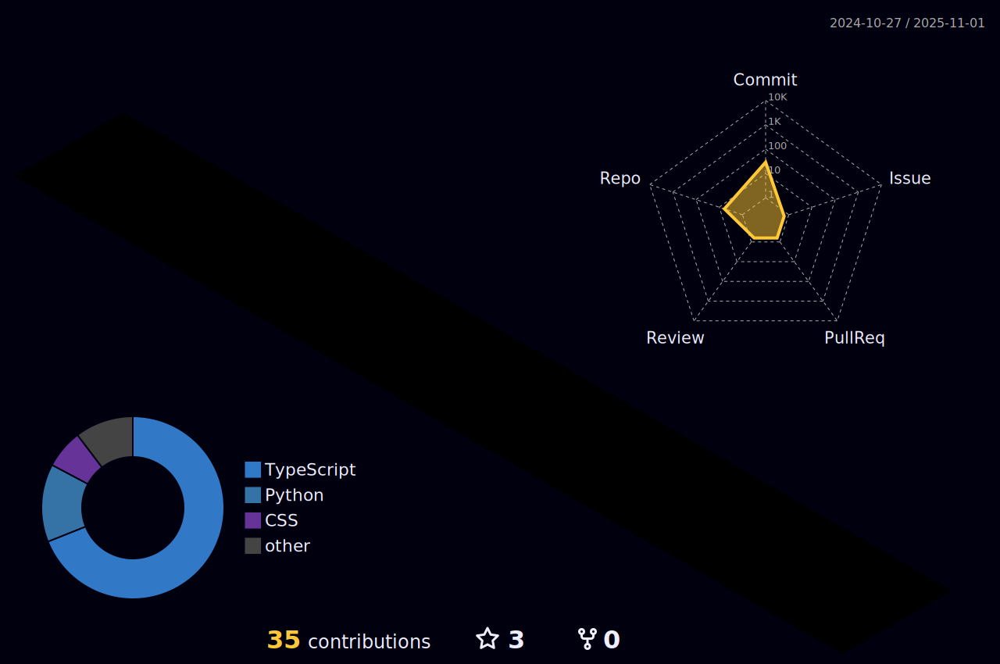

<h1 align="center">Estou </h1>
<h6 align="center">Olá pessoal, sou o Thiago e estou em constante construção e desenvolvimento.</h6>

💻 **Estou me graduando em Ciência da Computação.**   
🧑ğŸ½â€ğŸ’¼ **Atuo como Administrador de Redes e Infraestrutura.**   🕵ğŸ½â€â™‚ï¸ **Em busca da 1ª oportunidade como desenvolvedor.**   😠**Apaixonado por Filme, Séries, Animes e Games!**

  

<h2 align="center" style="display: inline_block">Skills: </h2>

 
  
  
  
  
  

<h2 align="center">Tecnologias utilizadas:</h2>

 
  
  
  
  

  
  

  

   

  
  
  
 
   
  

  
  

 |  |  |  
 | ----------- | ----------- |

 

  

 
 
 

 
  
  

  

 

   

 

 